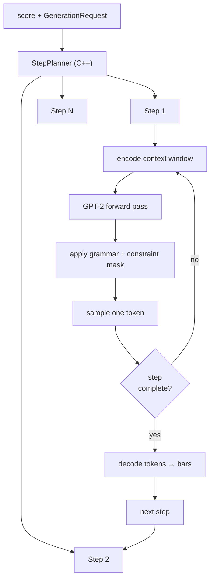

# How Generation Works

## The composer's view

From a composer's perspective, midigpt is a collaborator you can hand a piece of music to and say: *"fill in these bars"* or *"write a new track from scratch"*. You describe what you want — which bars to generate, how dense the notes should be, how much polyphony — and the model produces music that fits the surrounding context.

Under the hood, this involves breaking your request into a sequence of **generation steps** and running the language model once per step. Understanding steps is the key to understanding every control parameter in `InferenceConfig`.

---

## The step planner

When you call `engine.session(score, request).run()`, the C++ `StepPlanner` analyses your `GenerationRequest` and produces an ordered list of `GenerationStep`s. Each step is one independent forward pass through the model.



The planner decides:

- **How many steps** — one per target bar per track, in an order that lets each step use the output of previous ones as context.
- **Which bars are in the context window** — a sliding window of `model_dim` bars centred around the target bars.
- **How many tracks to encode at once** — controlled by `tracks_per_step`.

---

## The context window

Every step encodes a fixed-width slice of the score. That slice is `model_dim` bars wide and contains up to `tracks_per_step` tracks.

Within the window, each bar plays one of three roles:

| Role | What it contains | How it's encoded |
|---|---|---|
| **Context** | Real notes — either the original content or bars already generated by a previous step | Full token sequence |
| **Target** | The bar(s) to be generated in this step | Empty — the model fills these in |
| **Masked** | Future bars that will be generated in a later step | Represented according to `mask_mode` |

A typical infill window looks like this:

```
◀────────────── model_dim bars ──────────────▶

  bar 0       bar 1       bar 2       bar 3
┌──────────┬──────────┬──────────┬──────────┐
│ CONTEXT  │ CONTEXT  │  TARGET  │  MASKED  │
│ (notes)  │ (notes)  │ (empty)  │(future?) │
└──────────┴──────────┴──────────┴──────────┘
```

The model sees context bars, predicts the target bar, and the masked bars are hidden so it cannot "cheat" by looking ahead.

### `model_dim` — musical context size

`model_dim` is **not** an architecture parameter. It is the number of bars the model sees in each step. Every pretrained checkpoint was trained on specific window sizes, recorded in `num_bars_map` — you must pass a `model_dim` value that appears in that list.

A larger `model_dim` gives the model more musical context (useful for long-range phrasing) but costs more memory and is slower. A smaller value is faster and works well for local texture generation.

### `tracks_per_step`

How many tracks are packed into the token stream per step. Higher values let the model see inter-track relationships (harmony, rhythm interaction) but increase sequence length. The default is the number of non-ignored tracks in the request.

### `bars_per_step`

How many target bars are generated in a single step. A value of 1 gives the model maximum context around each bar but requires more steps. A higher value generates multiple bars in one forward pass at the cost of less surrounding context per bar.

---

## Masking strategies

The key design question for any generative model with infill is: **how should the model represent bars it has not yet generated?**

midigpt offers five strategies, set via `InferenceConfig(mask_mode=...)`.

### `"token"` — explicit mask token

The encoder emits a special `MaskBar` token for each masked bar. The model is trained to understand this as "a bar will appear here but its content is unknown". This is the most explicit signal but requires the encoder vocabulary to include a `MaskBar` domain.

```
[ CONTEXT ] [ CONTEXT ] [ TARGET ] [ MaskBar ] [ MaskBar ]
```

> Only available on models trained with `MaskBar` support. No released checkpoint currently has this — it's part of the planned `ghost` architecture (see [docs/models.md#ghost](models.md#ghost)).

### `"attention"` — exact span masking

Masked bars are encoded normally but their positions are zeroed in the KV cache after the prefill step — the model physically cannot attend to them. This is precise and works on any encoder.

```
[ CONTEXT ] [ CONTEXT ] [ TARGET ] [ encoded | zeroed in KV ]
```

### `"attention_approx"` — approximate span masking

A single attention mask is applied at prefill covering all masked positions, and the KV cache is surgically trimmed after. Cheaper than exact masking for long sequences.

### `"attention_skip"` — filtered input

Tokens for masked bars are removed from the input sequence entirely and `position_ids` are passed explicitly so the model maintains correct positional awareness. Lightest on compute.

### `"remove"` — omit entirely

Masked bars are not included in the token stream at all. The simplest approach and the one with the shortest sequences, but gives the model no signal about where future bars will fall.

---

## Infill vs. autoregressive

These two modes differ in where target bars sit relative to context:

**Infill** — target bars are surrounded by context on both sides. The model fills a gap.

```
[ CONTEXT ] [ CONTEXT ] [ TARGET ] [ TARGET ] [ CONTEXT ] [ CONTEXT ]
```

**Autoregressive** — target bars extend past the end of any existing content. The model generates forward in time.

```
[ CONTEXT ] [ CONTEXT ] [ CONTEXT ] [ TARGET ] [ TARGET ] [ TARGET ]
                                       ← generated left to right →
```

In AR mode there are no future bars to mask, so `mask_mode` has no effect. The model generates the next bar given everything before it, one bar (or one step) at a time.

---

## Putting it together

When you build a `GenerationRequest`, you are telling the planner:

- **Which bars to generate** (`TrackPrompt.bars`) — these become targets.
- **Which bars to ignore** (`TrackPrompt.ignore`) — these are excluded entirely.
- **Which bars to hide** (`TrackPrompt.mask_bars`) — these are always masked regardless of mode.
- **How wide the context window should be** (`InferenceConfig.model_dim`).
- **How to represent unknowns** (`InferenceConfig.mask_mode`).
- **What musical character to aim for** (`TrackPrompt.attributes` and `TrackPrompt.bar_attributes`).

The planner turns those instructions into the minimal set of steps required to generate all requested bars, scheduling them so earlier steps' output feeds into later steps' context.
