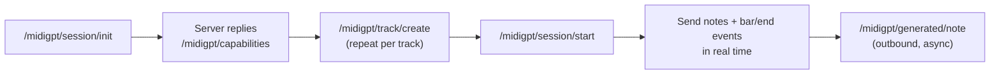

# Real-time OSC Server

The `midigpt[realtime]` extra adds a UDP OSC server for DAW and live-performance integration. The server listens for incoming note and bar events and streams generated notes back in real time.

## Setup

```bash
pip install "midigpt[realtime]"
midigpt-server --ckpt models/yellow.pt --port 7400
```

Generation is triggered bar-by-bar via `/midigpt/bar/end` and runs on a dedicated background thread — the OSC listener never blocks.

> **Studio UI:** The browser-based studio (`midigpt-studio`) is not included in the PyPI wheel. Clone the repository and run it directly from source. It requires a SoundFont file for audio playback — see `src/python/midigpt/osc/studio/static/sf2/SOUNDFONTS.md`.

---

## Session lifecycle



---

## Inbound messages

Messages sent **to** the server:

| Address | Arguments | Description |
|---|---|---|
| `/midigpt/session/init` | — | Start a new session; server replies with `/midigpt/capabilities` |
| `/midigpt/session/start` | — | Begin real-time generation |
| `/midigpt/session/end` | — | End the current session |
| `/midigpt/track/create` | `track_id, instrument, track_type` | Register a track (`track_type`: `"melodic"` or `"drum"`) |
| `/midigpt/note` | `track_id, pitch, velocity, onset, duration` | Push an incoming note event |
| `/midigpt/bar/end` | `track_id, bar_index, ts_num, ts_den` | Signal end of a bar; may trigger generation |
| `/midigpt/param/set` | `name, value` | Adjust a sampling parameter at runtime (see below) |
| `/midigpt/attr/set` | `track_id, name, level` | Set a quantized attribute override for a track |

---

## Outbound messages

Messages sent **from** the server:

| Address | Arguments | Description |
|---|---|---|
| `/midigpt/capabilities` | JSON string | Attribute names, sizes, and value labels for the loaded checkpoint |
| `/midigpt/generated/note` | `track_id, pitch, velocity, onset, duration` | A generated note event |
| `/midigpt/generated/features` | JSON string | Per-bar statistics (density, polyphony, etc.) |
| `/midigpt/prompt/state` | JSON string | Per-bar context/mask/generate state snapshot |

---

## Runtime parameters (`/midigpt/param/set`)

Adjust sampling behaviour without restarting the server:

| Parameter | Type | Description |
|---|---|---|
| `temperature` | float | Softmax temperature |
| `top_p` | float | Nucleus sampling threshold |
| `mask_p` | float | Anti-nucleus threshold |
| `mask_mode` | str | Masking strategy (`"attention"`, `"token"`, etc.) |
| `model_dim` | int | Context window in bars |
| `buffer_bars` | int | Number of bars to buffer before triggering generation |
| `lookahead_bars` | int | How far ahead to generate |
| `polyphony_hard_limit` | int | Hard polyphony cap per bar (0 = off) |
| `silence_check` | int | 1 = reject silent steps, 0 = allow |
| `novelty_check` | int | 1 = reject identical outputs, 0 = allow |
